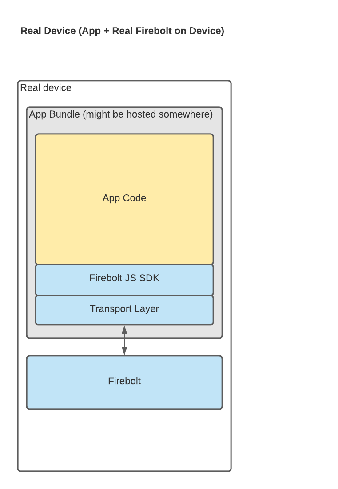
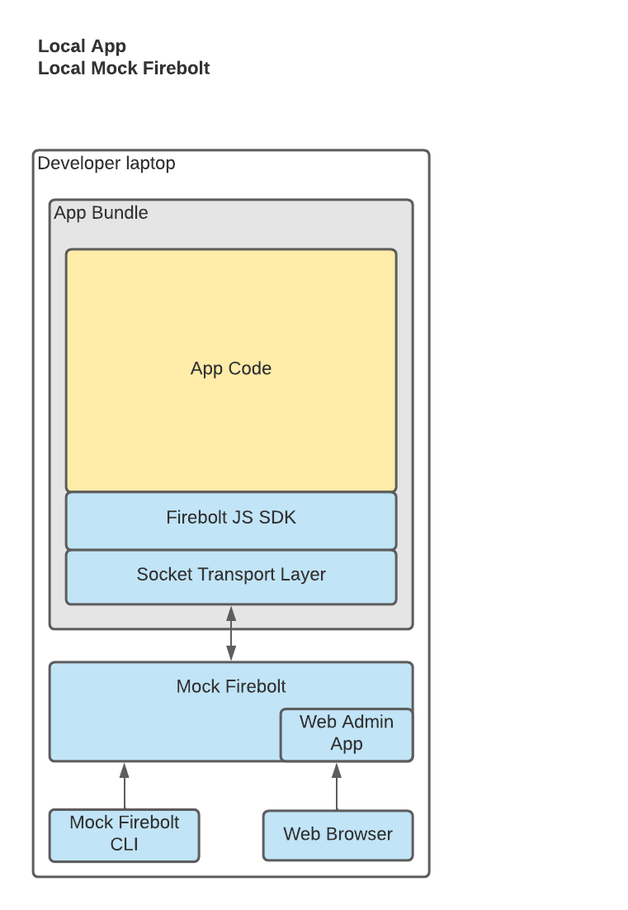
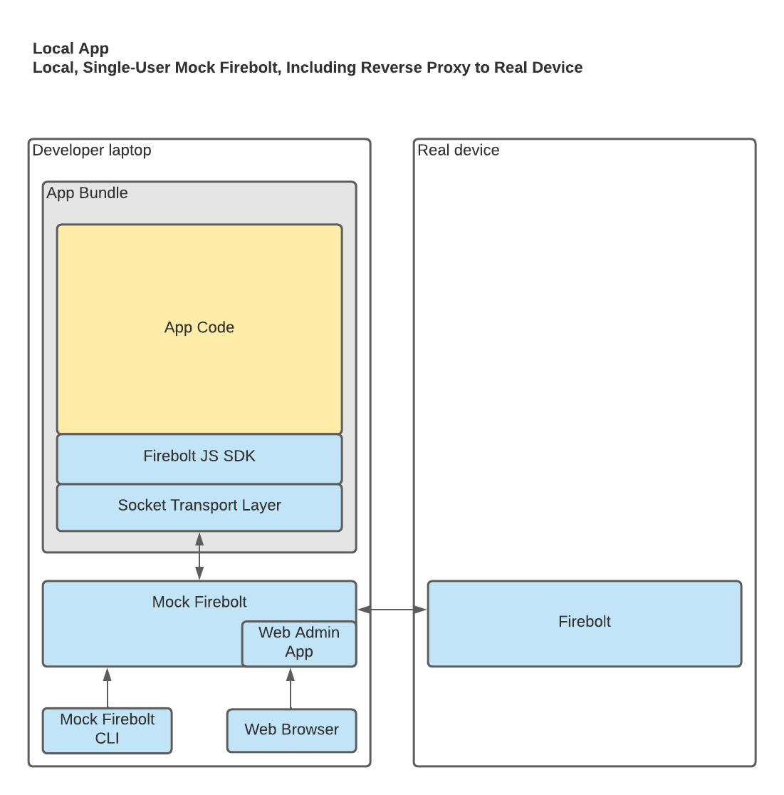

Mock Firebolt: System Configurations
====================================

Mock Firebolt might (eventually) be used in various system configurations, which are described here.

Note that the term "local" here means "on a developer's machine."

Note that "running an app under development locally" means visiting the app on the developer's machine, even if the app is deployed somewhere in the cloud (vs. running the app on a real device).

# System Configurations

## Firebolt on a Real Device (For Reference / Comparison)

NOTES:
- No Mock Firebolt is in use at all. This diagram is only included for comparison / reference purposes.

## 1. Local App, Local Mock Firebolt, No Real Device

NOTES:
- The developer runs the app under development locally on her machine
- The developer runs Mock Firebolt locally on her machine
- No real device is involved

- If the developer wants to use Mock Firebolt's REST API:
  - The developer points HTTP requests at http://localhost:3333/api/v1/...
- If the developer wants to use Mock Firebolt's CLI:
  - The developer runs CLI commands on her machine
  - The default configuration for the CLI is to talk to a local Mock Firebolt, so no special configuration is required
- If the developer wants to use Mock Firebolt's web admin tool:
  - The developer visits http://localhost:3333 in her browser
  - The default configuration for the web admin tool is to talk to a local Mock Firebolt, so no special configuration is required
- If the developer wants to use a Mock Firebolt browser extension:
  - The developer installs the extension in her browser
  - The default configuration for the web extension is to talk to a local Mock Firebolt, so no special configuration is required

## 2. Local App, Deployed/Shared Mock Firebolt, No Real Device

**IMPORTANT NOTE: There are no plans to support a hosted multi-user Mock Firebolt as a service.**

Mock Firebolt does support separate users (keeping mock override data for each user separate from that of all other users). As such, it can be deployed once somewhere on a LAN, say, such that a team of developers can share it. Note, however, that it does not persist any mock override data, so if it crashes, all users would be affected.

## 3. Local App, Local Mock Firebolt, With Real Device

**IMPORTANT NOTE: This is not yet supported.**

NOTES:
- Like #1 above, but:
- The developer can configure Mock Firebolt to act as a reverse proxy for a real device
  - Details @TODO, but presumably providing a web socket URL and token, perhaps after going through some kind of pairing process with the real device.
